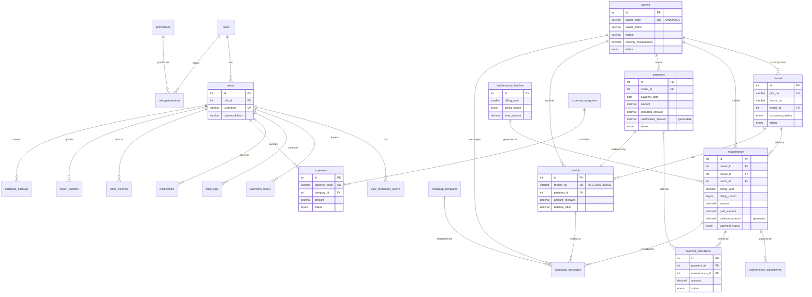

# Step 1 — System Architecture, ER Diagram & Database Table Design

**Project:** Residential Owners Welfare Association Management Portal (ROWA Portal)
**Stack:** PHP 8.1+/8.2 · CodeIgniter 3.1.13 · MySQL 8.0.16+ (InnoDB, utf8mb4) · Bootstrap 5 · jQuery · DataTables · Chart.js · Font Awesome · Dompdf
**Status:** Design baseline. Steps 2–10 implement exactly this design; any deviation will be called out explicitly.

---

## 1. System Architecture

### 1.1 Deployment view

```text
┌──────────────────────────── Browser (Desktop / Mobile) ────────────────────────────┐
│ Bootstrap 5 UI · jQuery · DataTables (+Buttons: Excel/CSV/PDF/Print) · Chart.js     │
│ AJAX (JSON) with CSRF token on every POST                                            │
└───────────────────────────────────────┬────────────────────────────────────────────┘
                                        │ HTTPS
┌───────────────────────────────────────▼────────────────────────────────────────────┐
│ Apache (mod_rewrite) / Nginx  →  public/index.php   (document root = public/)        │
├─────────────────────────────────────────────────────────────────────────────────────┤
│ CodeIgniter 3 application                                                            │
│                                                                                      │
│  core/MY_Controller ──► Auth_Controller (login + session timeout + RBAC guard)        │
│        │                       │                                                     │
│        ▼                       ▼                                                     │
│  Controllers (thin)  ──►  Libraries (business services)  ──►  Models (Query Builder) │
│  Auth, Dashboard,         Auth_lib, Rbac, Audit,               User_model,           │
│  Owners, Houses,          Maintenance_engine,                  Owner_model, ...      │
│  Maintenance, Payments,   Payment_engine (DB transactions),                          │
│  Receipts, Expenses,      Receipt_pdf (Dompdf),                                      │
│  Reports, Users,          Whatsapp (driver: click_to_chat |                          │
│  Settings, Whatsapp,      cloud_api), Template_parser,                               │
│  Audit, Imports, Backup   Csv_importer, Db_backup                                    │
│                                                                                      │
│  Helpers: app_helper (money/date/escape), permission_helper (can()), ui_helper       │
│  Views: layouts/(header, sidebar, navbar, footer) + module views                     │
└───────────────────────────────────────┬────────────────────────────────────────────┘
                                        │ mysqli (CI3 Query Builder, bound params)
┌───────────────────────────────────────▼────────────────────────────────────────────┐
│ MySQL 8 — InnoDB, utf8mb4_unicode_ci, DECIMAL(12,2) for money, FK constraints        │
└─────────────────────────────────────────────────────────────────────────────────────┘
          storage/ (outside web root): uploads/expenses, uploads/logo*, receipts/pdf,
          imports/errors, backups, logs, sessions(cache)
          (*logo is copied to public/uploads/branding for display)
```

### 1.2 Layering rules

| Layer | Responsibility | Must NOT |
|---|---|---|
| **Controller** | Auth/permission check, input validation (`form_validation`), call service/model, render view or JSON | Contain SQL or financial math |
| **Library (service)** | Business rules, multi-table operations, DB transactions, audit calls | Read `$_POST` directly or echo output |
| **Model** | Single-table (or read-only join) Query Builder access | Start transactions on its own or apply business rules |
| **View** | Presentation only; all dynamic output escaped with `e()` (`html_escape`) | Query the DB |

Financial write paths (generate maintenance, collect payment, cancel payment, waive, advance adjustment) live **only** in `Maintenance_engine` and `Payment_engine`. Each runs inside `$this->db->trans_begin() … trans_commit()/trans_rollback()` and uses `SELECT … FOR UPDATE` row locks.

### 1.3 Project folder structure

```text
rowa-portal/
├── public/                         ← web document root
│   ├── index.php                   (CI front controller, paths point to ../application, ../system)
│   ├── .htaccess                   (rewrite to index.php, security headers)
│   ├── assets/
│   │   ├── css/app.css
│   │   ├── js/app.js               (CSRF-aware AJAX setup, toasts, confirm dialogs)
│   │   ├── js/modules/*.js         (owners.js, payments.js, maintenance.js, ...)
│   │   └── vendor/                 (bootstrap, jquery, datatables, chart.js, fontawesome)
│   └── uploads/branding/           (association logo - public, image only)
├── application/
│   ├── config/  (config.php, database.php, autoload.php, routes.php, app.php, whatsapp.php)
│   ├── core/    MY_Controller.php  (MY_Controller, Auth_Controller)
│   ├── controllers/  Auth, Dashboard, Owners, Houses, Maintenance, Payments, Receipts,
│   │                 Expenses, Incomes, Reports, Users, Settings, Whatsapp, Audit,
│   │                 Imports, Backup, Notifications
│   ├── models/       User_model, Role_model, Owner_model, House_model, Maintenance_model,
│   │                 Payment_model, Receipt_model, Expense_model, Income_model,
│   │                 Report_model, Settings_model, Whatsapp_model, Audit_model,
│   │                 Notification_model, Sequence_model, Import_model, Dashboard_model
│   ├── libraries/    Auth_lib, Rbac, Audit, Maintenance_engine, Payment_engine,
│   │                 Receipt_pdf, Whatsapp, Whatsapp/drivers/{Click_to_chat,Cloud_api},
│   │                 Template_parser, Csv_importer, Db_backup
│   ├── helpers/      app_helper.php, permission_helper.php, ui_helper.php
│   ├── views/        layouts/, auth/, dashboard/, owners/, houses/, maintenance/,
│   │                 payments/, receipts/, expenses/, incomes/, reports/, users/,
│   │                 settings/, whatsapp/, audit/, imports/, backup/, errors/
│   └── .htaccess     (Deny from all)
├── system/                         (CodeIgniter 3.1.13 core — unmodified)
├── storage/                        (writable, NOT web-accessible; .htaccess Deny from all)
│   ├── uploads/expenses/  receipts/  imports/  backups/  logs/
├── database/
│   ├── 01_schema.sql               (Step 2)
│   ├── 02_seed_master.sql          (roles, permissions, categories, templates, settings, admin)
│   └── 03_demo_data.sql            (10 owners/houses, maintenance, payments, receipts, expenses)
├── application/third_party/        (Env.php .env loader; dompdf/ release package added in Step 7)
├── composer.json
├── .env.example                    (DB + WhatsApp Cloud credentials; read by config files)
└── docs/
```

> **Shared hosting fallback:** if the host cannot point the document root to `public/`, the
> root `index.php` variant plus `Deny from all` `.htaccess` files in `application/`, `system/`,
> `storage/`, `database/` will be provided.

### 1.4 Third-party libraries (bundled - no Composer or Node.js required)

| Library | Purpose |
|---|---|
| `dompdf/dompdf` 3.x (official release zip in `application/third_party/dompdf`) | Receipt PDF, owner statement PDF, report PDF |
| *(PhpSpreadsheet dropped in Step 3)* | Owner import uses CSV natively; Excel export is done in the browser by DataTables Buttons + JSZip |
| DataTables 1.13 + Buttons + JSZip + pdfmake | Client-side list export (Excel/CSV/PDF/Print) |
| Chart.js 4 | Dashboard charts |

### 1.5 Request lifecycle & security pipeline

```text
Request → index.php → CI Router → Auth_Controller::__construct()
   1. Session (database driver, ci_sessions, regenerate every 300s, HttpOnly + SameSite=Lax, Secure on HTTPS)
   2. Is logged in?            no → remember-me cookie (selector/validator) → else redirect /auth/login
   3. Idle timeout exceeded?   yes → destroy session → /auth/login?timeout=1
   4. User still Active?       re-checked from DB every request (cheap PK lookup)
   5. Controller declares   $this->rbac->require('payments.create')  → 403 page / JSON 403
   6. CSRF (CI3 global, token regenerated, AJAX sends X-CSRF header via app.js)
   7. form_validation + typed casting → Service/Model (Query Builder, bound params)
   8. View output escaped via e(); JSON via output->set_content_type('application/json')
   9. Audit->log() on every create/update/cancel/financial action
```

### 1.6 Role-based access (RBAC)

Permissions are stored in the DB (`permissions`, `role_permissions`) so new modules/roles can be added without code changes. Controllers check **permission keys**, never role names. Super Admin bypasses checks.

| Permission key | Super Admin | Admin / Secretary | Treasurer | Viewer |
|---|:-:|:-:|:-:|:-:|
| dashboard.view | ✔ | ✔ | ✔ | ✔ |
| owners.view | ✔ | ✔ | ✔ | ✔ |
| owners.create / owners.edit | ✔ | ✔ | – | – |
| owners.delete (soft) | ✔ | ✔ | – | – |
| owners.import | ✔ | ✔ | – | – |
| houses.view | ✔ | ✔ | ✔ | ✔ |
| houses.create / houses.edit / houses.delete | ✔ | ✔ | – | – |
| maintenance.view | ✔ | ✔ | ✔ | ✔ |
| maintenance.generate | ✔ | ✔ | – | – |
| maintenance.waive | ✔ | ✔ | – | – |
| payments.view | ✔ | ✔ | ✔ | ✔ |
| payments.create | ✔ | ✔ | ✔ | – |
| payments.cancel | ✔ | – | ✔ | – |
| receipts.view / receipts.download | ✔ | ✔ | ✔ | ✔ |
| receipts.generate | ✔ | ✔ | ✔ | – |
| whatsapp.send | ✔ | ✔ | ✔ | – |
| whatsapp.templates | ✔ | ✔ | – | – |
| expenses.view | ✔ | ✔ | ✔ | ✔ |
| expenses.create / expenses.edit / expenses.cancel | ✔ | – | ✔ | – |
| incomes.view | ✔ | ✔ | ✔ | ✔ |
| incomes.create / incomes.edit / incomes.cancel | ✔ | – | ✔ | – |
| reports.view (outstanding, collection, statement) | ✔ | ✔ | ✔ | ✔ |
| reports.financial (income & expense) | ✔ | ✔ | ✔ | ✔ |
| users.manage | ✔ | – | – | – |
| settings.manage | ✔ | – | – | – |
| audit.view | ✔ | – | – | – |
| backup.manage | ✔ | – | – | – |

*(Viewer is read-only: it can see every module except Users/Settings/Audit/Backup and cannot write anything.)*

---

## 2. Core Financial Model (the rules the schema enforces)

### 2.1 Concepts

| Concept | Table | Meaning |
|---|---|---|
| **Charge** | `maintenance` | Amount an owner owes for a house for a month (or an opening balance) |
| **Payment** | `payments` | Money actually received (one transaction, one receipt) |
| **Allocation** | `payment_allocations` | Which part of which payment settles which charge (many-to-many) |
| **Adjustment** | `maintenance_adjustments` | Waiver/discount that reduces a charge without money |
| **Advance (credit)** | `payments.allocated_amount < amount` | The unallocated portion of an *advance* payment |

```text
maintenance.balance_amount = amount − paid_amount − waived_amount      (stored generated column)
maintenance.paid_amount    = Σ active allocations for that maintenance   (kept in sync by Payment_engine)
payment.unallocated_amount = amount − allocated_amount                  (stored generated column = advance credit)

Owner outstanding      = Σ maintenance.balance_amount   (record_status = Active)
Owner advance credit   = Σ payments.unallocated_amount  (status = Active)
Owner net payable      = outstanding − advance credit
```

### 2.2 Rule → enforcement mapping

| # | Rule | Enforced by |
|---|---|---|
| 1 | One owner → many maintenance records | FK `maintenance.owner_id` (1:N) |
| 2 | One maintenance → many payment transactions | `payment_allocations` (N:M between payments and maintenance) |
| 3 | Payment ≤ outstanding unless advance | `Payment_engine` validation + DB `CHECK (is_advance = 1 OR allocated_amount = amount OR status <> 'Active')` |
| 4 | Paid maintenance cannot be deleted | No DELETE path in code; `ON DELETE RESTRICT` on `payment_allocations.maintenance_id`; only `record_status = 'Cancelled'` allowed when `paid_amount = 0` |
| 5 | Cancelled payments keep original transaction | `payments.status = 'Cancelled'` + allocations set to `Reversed` (never deleted); receipt marked `Cancelled` |
| 6 | Receipt numbers unique | `UNIQUE (receipts.receipt_no)` + `document_sequences` row locked `FOR UPDATE` inside the payment transaction |
| 7 | No duplicate monthly generation | `UNIQUE (maintenance_batches.billing_year, billing_month)` **and** `UNIQUE (maintenance.house_id, billing_year, billing_month, charge_type)` |
| 8 | Money is DECIMAL | All amount columns `DECIMAL(12,2)`; `CHECK (amount >= 0)` constraints |

### 2.3 Payment collection transaction

```text
Payment_engine::collect(owner_id, amount, mode, ref, date, selected_maintenance_ids[], is_advance)
BEGIN
  SELECT owner … FOR UPDATE                                     (serialises payments per owner)
  SELECT open maintenance rows for owner FOR UPDATE             (oldest period first, or selected rows)
  plan = FIFO allocation of amount over balances
  excess = amount − Σ plan
  IF excess > 0 AND NOT is_advance → ROLLBACK, "Amount exceeds outstanding ₹X. Tick 'Advance' to keep the excess as credit."
  INSERT payments (amount, allocated_amount = Σ plan, is_advance)
  INSERT payment_allocations (one row per maintenance in plan)
  UPDATE maintenance SET paid_amount = paid_amount + x, payment_status = Paid | Partially Paid
  SELECT document_sequences (RECEIPT, year) FOR UPDATE → last_number + 1 → REC-2026-000001
  INSERT receipts (snapshot of owner/house/amounts, previous_outstanding, balance_after)
  INSERT audit_logs (Payment Added, Receipt Generated)
COMMIT          (any failure → ROLLBACK, nothing persisted)
After commit: PDF rendered (Dompdf) and cached to storage/receipts/; regenerated on demand if missing.
```

### 2.4 Advance payment handling

Example: monthly ₹300, October generated, owner pays ₹900 with **Advance** ticked.

1. ₹300 → October (allocation, source `Payment`). ₹600 remains as **advance credit** on the payment (`unallocated_amount = 600`).
2. The receipt shows *Advance ₹600 — to be adjusted against upcoming months*.
3. When November is generated, `Maintenance_engine` automatically applies the owner's credit FIFO (oldest payment first). It creates an allocation with source `Advance Adjustment` and marks November **Paid**. December is handled the same way.
4. The owner statement shows the advance and every adjustment. **Payments → Advance Credits** lists every owner with unused credit and lets you **Apply Now**, which allocates the credit to existing open dues.

This keeps one payment → one receipt and avoids pre-creating future months that would clash with the bulk generation.

### 2.5 Payment cancellation

```text
BEGIN
  lock payment (must be Active) → status = Cancelled, cancel_reason, cancelled_by/at
  allocations of this payment → status = Reversed, reversed_at
  for each affected maintenance: paid_amount = Σ remaining Active allocations, recompute payment_status
  receipt → status = Cancelled (number stays reserved, never reused)
  audit_logs (Payment Cancelled, old/new JSON)
COMMIT
```

### 2.6 Maintenance generation

```text
Preview : active houses with an active current owner, maintenance_start_date ≤ period,
          no existing Monthly record for that house/period → count + Σ amount
          (amount = owner.monthly_maintenance, else default amount entered on the screen)
Generate: batch row exists for (year, month)? → "Maintenance for October 2026 has already been generated."
          BEGIN → INSERT maintenance_batches → INSERT maintenance rows → auto-apply advance credits → audit → COMMIT
          Owners added later in the month: "Generate for remaining owners" adds only the missing
          rows to the same batch; the unique key blocks every duplicate.
```

---

## 3. ER Diagram



---

## 4. Complete Table Design

**Conventions (all tables):** `ENGINE=InnoDB`, `DEFAULT CHARSET=utf8mb4 COLLATE=utf8mb4_unicode_ci`; PK `id INT UNSIGNED AUTO_INCREMENT` (audit logs use `BIGINT`); `created_at DATETIME DEFAULT CURRENT_TIMESTAMP`, `updated_at DATETIME DEFAULT CURRENT_TIMESTAMP ON UPDATE CURRENT_TIMESTAMP`; money `DECIMAL(12,2) NOT NULL DEFAULT 0.00`; `created_by`/`updated_by` → `users.id` (`ON DELETE SET NULL`). Financial tables never use `ON DELETE CASCADE`.

Legend: **PK** primary key · **UK** unique · **FK** foreign key · **IX** index · **NN** not null

### 4.1 Security & access (8 tables)

#### `roles`
| Column | Type | Constraints / Notes |
|---|---|---|
| id | TINYINT UNSIGNED | PK, AI |
| role_key | VARCHAR(30) | UK, NN — `super_admin`, `admin`, `treasurer`, `viewer` |
| role_name | VARCHAR(50) | NN |
| description | VARCHAR(255) | |
| is_system | TINYINT(1) | DEFAULT 1 — system roles cannot be deleted |
| created_at, updated_at | DATETIME | |

#### `permissions`
| Column | Type | Constraints / Notes |
|---|---|---|
| id | SMALLINT UNSIGNED | PK, AI |
| perm_key | VARCHAR(60) | UK, NN — e.g. `payments.create` |
| module | VARCHAR(40) | NN, IX — groups permissions in the UI |
| description | VARCHAR(150) | |

#### `role_permissions`
| Column | Type | Constraints / Notes |
|---|---|---|
| role_id | TINYINT UNSIGNED | PK(role_id, permission_id), FK → roles ON DELETE CASCADE |
| permission_id | SMALLINT UNSIGNED | FK → permissions ON DELETE CASCADE |

#### `users`
| Column | Type | Constraints / Notes |
|---|---|---|
| id | INT UNSIGNED | PK, AI |
| role_id | TINYINT UNSIGNED | NN, FK → roles (RESTRICT), IX |
| full_name | VARCHAR(100) | NN |
| username | VARCHAR(50) | UK, NN |
| email | VARCHAR(150) | UK, NN |
| mobile | VARCHAR(15) | |
| password_hash | VARCHAR(255) | NN — `password_hash(PASSWORD_DEFAULT)` |
| status | ENUM('Active','Inactive') | NN DEFAULT 'Active' |
| failed_attempts | TINYINT UNSIGNED | DEFAULT 0 |
| locked_until | DATETIME | NULL — account lockout after N failures |
| must_change_password | TINYINT(1) | DEFAULT 0 |
| password_changed_at | DATETIME | NULL |
| last_login_at | DATETIME | NULL |
| last_login_ip | VARCHAR(45) | NULL (IPv6-safe) |
| created_by, updated_by | INT UNSIGNED | FK → users SET NULL |
| created_at, updated_at | DATETIME | |

#### `user_remember_tokens` (Remember-me, selector/validator pattern)
| Column | Type | Constraints / Notes |
|---|---|---|
| id | INT UNSIGNED | PK |
| user_id | INT UNSIGNED | NN, FK → users CASCADE, IX |
| selector | CHAR(24) | UK, NN — public half stored in cookie |
| validator_hash | CHAR(64) | NN — SHA-256 of secret half (compared with `hash_equals`) |
| user_agent | VARCHAR(255) | |
| expires_at | DATETIME | NN, IX |
| created_at | DATETIME | |

#### `password_resets`
| Column | Type | Constraints / Notes |
|---|---|---|
| id | INT UNSIGNED | PK |
| user_id | INT UNSIGNED | NN, FK → users CASCADE |
| token_hash | CHAR(64) | UK, NN — SHA-256 of emailed token |
| expires_at | DATETIME | NN (60 minutes) |
| used_at | DATETIME | NULL — single use |
| request_ip | VARCHAR(45) | |
| created_at | DATETIME | |

#### `login_attempts`
| Column | Type | Constraints / Notes |
|---|---|---|
| id | INT UNSIGNED | PK |
| login_identifier | VARCHAR(150) | NN — username/email entered |
| ip_address | VARCHAR(45) | NN |
| is_success | TINYINT(1) | NN DEFAULT 0 |
| attempted_at | DATETIME | NN DEFAULT CURRENT_TIMESTAMP |
| | | IX(ip_address, attempted_at), IX(login_identifier, attempted_at) |

The default is 5 failures in 15 minutes for each IP or identifier. Once that limit is hit, the account and the IP are locked for 15 minutes. These values can be changed in `system_settings`.

#### `ci_sessions` (CodeIgniter 3 database session driver)
| Column | Type | Constraints / Notes |
|---|---|---|
| id | VARCHAR(128) | PK |
| ip_address | VARCHAR(45) | NN |
| timestamp | INT UNSIGNED | NN DEFAULT 0, IX |
| data | BLOB | NN |

### 4.2 Configuration (4 tables)

#### `association_settings` (single row, `id = 1`)
| Column | Type | Constraints / Notes |
|---|---|---|
| id | TINYINT UNSIGNED | PK — always 1 (`CHECK (id = 1)`) |
| association_name | VARCHAR(200) | NN |
| short_name | VARCHAR(60) | used in WhatsApp/titles |
| registration_no | VARCHAR(60) | |
| address | VARCHAR(255) | |
| city | VARCHAR(80) | |
| district | VARCHAR(80) | |
| state | VARCHAR(80) | |
| pincode | VARCHAR(10) | |
| mobile | VARCHAR(15) | |
| email | VARCHAR(150) | |
| website | VARCHAR(150) | |
| logo_path | VARCHAR(255) | relative path in `public/uploads/branding/` |
| bank_name | VARCHAR(100) | |
| bank_account_no | VARCHAR(30) | |
| bank_ifsc | VARCHAR(15) | |
| bank_branch | VARCHAR(100) | |
| upi_id | VARCHAR(100) | |
| default_maintenance_amount | DECIMAL(12,2) | NN DEFAULT 0 |
| default_due_day | TINYINT UNSIGNED | DEFAULT 10 — due date suggestion |
| receipt_prefix | VARCHAR(10) | NN DEFAULT 'REC' |
| currency_symbol | VARCHAR(5) | DEFAULT '₹' |
| receipt_footer_note | VARCHAR(255) | e.g. "Computer generated receipt" |
| updated_by | INT UNSIGNED | FK → users SET NULL |
| updated_at | DATETIME | |

#### `system_settings` (key/value, non-secret technical settings)
| Column | Type | Constraints / Notes |
|---|---|---|
| setting_key | VARCHAR(100) | PK |
| setting_value | TEXT | |
| updated_at | DATETIME | |

Seed keys: `whatsapp_mode` (`click_to_chat` \| `cloud_api`), `whatsapp_country_code` (`91`), `whatsapp_cloud_phone_number_id`, `whatsapp_cloud_api_version`, `session_timeout_minutes` (30), `max_login_attempts` (5), `lockout_minutes` (15), `receipt_paper` (`A4` \| `A5`).
**The WhatsApp Cloud API access token is never stored in the DB or the UI.** It is read from `.env` → `application/config/whatsapp.php`.

#### `whatsapp_templates`
| Column | Type | Constraints / Notes |
|---|---|---|
| id | SMALLINT UNSIGNED | PK |
| template_key | VARCHAR(50) | UK, NN — `payment_receipt`, `maintenance_reminder`, extensible |
| template_name | VARCHAR(100) | NN |
| message_body | TEXT | NN — supports `{OWNER_NAME} {PLOT_NO} {HOUSE_NO} {MONTH} {YEAR} {AMOUNT} {PAYMENT_MODE} {RECEIPT_NO} {BALANCE} {ASSOCIATION_NAME}` (+ `{PAYMENT_DATE}`, `{DUE_DATE}`) |
| cloud_template_name | VARCHAR(100) | NULL — Meta-approved template name for Cloud API mode |
| cloud_language | VARCHAR(10) | DEFAULT 'en' |
| is_active | TINYINT(1) | DEFAULT 1 |
| updated_by | INT UNSIGNED | FK → users SET NULL |
| created_at, updated_at | DATETIME | |

#### `document_sequences` (gap-free, race-safe numbering)
| Column | Type | Constraints / Notes |
|---|---|---|
| id | INT UNSIGNED | PK |
| seq_type | VARCHAR(20) | NN — `RECEIPT`, `EXPENSE`, `INCOME` |
| seq_year | SMALLINT UNSIGNED | NN |
| last_number | INT UNSIGNED | NN DEFAULT 0 |
| updated_at | DATETIME | |
| | | UK(seq_type, seq_year) |

`Sequence_model::next('RECEIPT', 2026)` → `SELECT … FOR UPDATE`, increment, returns `REC-2026-000001` (the prefix comes from `association_settings.receipt_prefix`). It always runs inside the caller's transaction, so a rolled-back payment never uses up a number.

### 4.3 Master data (2 tables)

#### `owners`
| Column | Type | Constraints / Notes |
|---|---|---|
| id | INT UNSIGNED | PK, AI |
| owner_code | VARCHAR(12) | UK, NULL until set — `OWN` + 5-digit id, set in same transaction as insert |
| owner_name | VARCHAR(120) | NN, IX |
| co_owner_name | VARCHAR(120) | NULL (co-ownership is recorded here) |
| mobile | VARCHAR(15) | NN, IX |
| whatsapp_no | VARCHAR(15) | NULL → falls back to mobile |
| email | VARCHAR(150) | NULL |
| permanent_address | VARCHAR(255) | |
| residential_address | VARCHAR(255) | |
| owner_type | ENUM('Individual','Joint','Company','NRI','Other') | NN DEFAULT 'Individual' |
| joining_date | DATE | NULL |
| monthly_maintenance | DECIMAL(12,2) | NN DEFAULT 0 — 0 means "use default" |
| maintenance_start_date | DATE | NULL — generation skips periods before this |
| status | ENUM('Active','Inactive') | NN DEFAULT 'Active', IX |
| remarks | VARCHAR(500) | |
| is_deleted | TINYINT(1) | NN DEFAULT 0 — soft delete; blocked if any maintenance/payment exists |
| deleted_at | DATETIME | NULL |
| created_by, updated_by | INT UNSIGNED | FK → users SET NULL |
| created_at, updated_at | DATETIME | |

*Occupancy status is a property of the house, so it is stored only in `houses.occupancy_status`. The Owner form shows and edits it through the house assigned there, which avoids keeping two copies.*

#### `houses`
| Column | Type | Constraints / Notes |
|---|---|---|
| id | INT UNSIGNED | PK, AI ("Plot ID") |
| plot_no | VARCHAR(20) | **UK**, NN |
| house_no | VARCHAR(20) | NULL (vacant plot) |
| block | VARCHAR(20) | NN DEFAULT '' |
| street | VARCHAR(100) | |
| house_type | ENUM('Independent House','Villa','Apartment','Row House','Vacant Plot','Commercial','Other') | NN |
| built_status | ENUM('Built','Under Construction','Not Built') | NN DEFAULT 'Built' |
| occupancy_status | ENUM('Owner Occupied','Tenant Occupied','Vacant') | NN DEFAULT 'Vacant', IX |
| owner_id | INT UNSIGNED | NULL, FK → owners (RESTRICT), IX — **current** owner |
| area_sqft | DECIMAL(10,2) | NULL |
| uds_sqft | DECIMAL(10,2) | NULL |
| remarks | VARCHAR(500) | |
| status | ENUM('Active','Inactive') | NN DEFAULT 'Active' |
| created_by, updated_by | INT UNSIGNED | FK → users SET NULL |
| created_at, updated_at | DATETIME | |
| | | UK(block, house_no) — no duplicate house numbers within a block |

*A house has a single `owner_id` column, so the database itself prevents assigning one house to two owners. One owner can hold several plots. A co-owner is recorded on the owner (`co_owner_name`) and does not need a second owner row. Ownership transfers are written to `audit_logs`, and every historical bill keeps its own `owner_id`.*

### 4.4 Maintenance & collections (6 tables)

#### `maintenance_batches`
| Column | Type | Constraints / Notes |
|---|---|---|
| id | INT UNSIGNED | PK |
| billing_year | SMALLINT UNSIGNED | NN |
| billing_month | TINYINT UNSIGNED | NN, `CHECK (billing_month BETWEEN 1 AND 12)` |
| due_date | DATE | NN |
| default_amount | DECIMAL(12,2) | NN |
| total_records | INT UNSIGNED | NN DEFAULT 0 |
| total_amount | DECIMAL(12,2) | NN DEFAULT 0 |
| generated_by | INT UNSIGNED | FK → users SET NULL |
| generated_at | DATETIME | NN |
| | | **UK(billing_year, billing_month)** → "already generated" |

#### `maintenance`
| Column | Type | Constraints / Notes |
|---|---|---|
| id | INT UNSIGNED | PK ("Maintenance ID") |
| batch_id | INT UNSIGNED | NULL, FK → maintenance_batches RESTRICT |
| owner_id | INT UNSIGNED | NN, FK → owners RESTRICT |
| house_id | INT UNSIGNED | NN, FK → houses RESTRICT |
| charge_type | ENUM('Monthly','Opening Balance','Other') | NN DEFAULT 'Monthly' |
| billing_year | SMALLINT UNSIGNED | NN |
| billing_month | TINYINT UNSIGNED | NN, CHECK 1–12 |
| period_start | DATE | NN — first day of billing month (sorting/date-range reports) |
| due_date | DATE | NN |
| amount | DECIMAL(12,2) | NN, CHECK ≥ 0 |
| paid_amount | DECIMAL(12,2) | NN DEFAULT 0 |
| waived_amount | DECIMAL(12,2) | NN DEFAULT 0 |
| balance_amount | DECIMAL(12,2) | **GENERATED ALWAYS AS (amount − paid_amount − waived_amount) STORED** |
| payment_status | ENUM('Pending','Partially Paid','Paid','Waived') | NN DEFAULT 'Pending', IX |
| record_status | ENUM('Active','Cancelled') | NN DEFAULT 'Active' — only cancellable when paid_amount = 0 |
| description | VARCHAR(255) | e.g. "Opening balance on migration" |
| generated_at | DATETIME | NN |
| created_by | INT UNSIGNED | FK → users SET NULL |
| created_at, updated_at | DATETIME | |
| | | **UK(house_id, billing_year, billing_month, charge_type)** — duplicate guard |
| | | IX(owner_id, record_status, payment_status), IX(billing_year, billing_month), IX(period_start) |
| | | CHECK (paid_amount + waived_amount ≤ amount), CHECK (paid_amount ≥ 0 AND waived_amount ≥ 0) |

#### `maintenance_adjustments`
| Column | Type | Constraints / Notes |
|---|---|---|
| id | INT UNSIGNED | PK |
| maintenance_id | INT UNSIGNED | NN, FK → maintenance RESTRICT, IX |
| adjustment_type | ENUM('Waiver','Discount') | NN |
| amount | DECIMAL(12,2) | NN, CHECK > 0 |
| adjustment_date | DATE | NN |
| reason | VARCHAR(255) | NN |
| status | ENUM('Active','Reversed') | NN DEFAULT 'Active' |
| created_by | INT UNSIGNED | FK → users SET NULL |
| created_at, updated_at | DATETIME | |

#### `payments`
| Column | Type | Constraints / Notes |
|---|---|---|
| id | INT UNSIGNED | PK |
| owner_id | INT UNSIGNED | NN, FK → owners RESTRICT |
| payment_date | DATE | NN, IX |
| amount | DECIMAL(12,2) | NN, CHECK > 0 |
| allocated_amount | DECIMAL(12,2) | NN DEFAULT 0, CHECK ≤ amount |
| unallocated_amount | DECIMAL(12,2) | **GENERATED ALWAYS AS (amount − allocated_amount) STORED** = advance credit |
| is_advance | TINYINT(1) | NN DEFAULT 0 |
| payment_mode | ENUM('Cash','UPI','Bank Transfer','Cheque','NEFT','RTGS','Other') | NN |
| transaction_ref | VARCHAR(100) | NULL (required by validation for non-cash modes) |
| remarks | VARCHAR(500) | |
| request_token | CHAR(32) | UK, NULL — one-time form token; blocks duplicate payments from a double click or a page refresh (added in Step 2) |
| status | ENUM('Active','Cancelled','Reversed') | NN DEFAULT 'Active' |
| cancel_reason | VARCHAR(255) | NULL |
| cancelled_by | INT UNSIGNED | NULL, FK → users SET NULL |
| cancelled_at | DATETIME | NULL |
| received_by | INT UNSIGNED | FK → users SET NULL |
| created_by | INT UNSIGNED | FK → users SET NULL |
| created_at, updated_at | DATETIME | |
| | | IX(owner_id, status), IX(status, payment_date) |
| | | CHECK (is_advance = 1 OR allocated_amount = amount OR status <> 'Active') — Rule 3 |

Status meanings: **Cancelled** means the payment was entered in error and the receipt is void. **Reversed** means the money was refunded or a cheque bounced. In both cases the row is kept.

#### `payment_allocations`
| Column | Type | Constraints / Notes |
|---|---|---|
| id | INT UNSIGNED | PK |
| payment_id | INT UNSIGNED | NN, FK → payments RESTRICT, IX |
| maintenance_id | INT UNSIGNED | NN, FK → maintenance RESTRICT |
| amount | DECIMAL(12,2) | NN, CHECK > 0 |
| allocation_source | ENUM('Payment','Advance Adjustment') | NN DEFAULT 'Payment' |
| allocated_at | DATETIME | NN |
| status | ENUM('Active','Reversed') | NN DEFAULT 'Active' |
| reversed_at | DATETIME | NULL |
| created_by | INT UNSIGNED | FK → users SET NULL |
| | | IX(maintenance_id, status) |

#### `receipts`
| Column | Type | Constraints / Notes |
|---|---|---|
| id | INT UNSIGNED | PK |
| receipt_no | VARCHAR(30) | **UK**, NN — `REC-2026-000001` |
| payment_id | INT UNSIGNED | **UK**, NN, FK → payments RESTRICT (1 payment = 1 receipt) |
| owner_id | INT UNSIGNED | NN, FK → owners RESTRICT, IX |
| house_id | INT UNSIGNED | NULL, FK → houses RESTRICT |
| receipt_date | DATE | NN |
| owner_name | VARCHAR(120) | NN — snapshot (receipt never changes if owner is edited) |
| plot_no | VARCHAR(20) | snapshot |
| house_no | VARCHAR(20) | snapshot |
| mobile | VARCHAR(15) | snapshot |
| period_label | VARCHAR(150) | e.g. "October 2026" / "Aug 2026 – Oct 2026" |
| maintenance_amount | DECIMAL(12,2) | NN — Σ charges covered |
| previous_outstanding | DECIMAL(12,2) | NN — owner outstanding before payment |
| amount_received | DECIMAL(12,2) | NN |
| advance_amount | DECIMAL(12,2) | NN DEFAULT 0 |
| balance_after | DECIMAL(12,2) | NN |
| payment_mode | VARCHAR(20) | NN snapshot |
| transaction_ref | VARCHAR(100) | snapshot |
| received_by_name | VARCHAR(100) | snapshot |
| pdf_path | VARCHAR(255) | NULL — cached file in `storage/receipts/` |
| status | ENUM('Active','Cancelled') | NN DEFAULT 'Active' |
| cancelled_at | DATETIME | NULL |
| created_by | INT UNSIGNED | FK → users SET NULL |
| created_at, updated_at | DATETIME | |

### 4.5 Finance (3 tables)

#### `expense_categories`
| Column | Type | Constraints / Notes |
|---|---|---|
| id | SMALLINT UNSIGNED | PK |
| name | VARCHAR(60) | UK, NN — seeded: Electricity, Water, Cleaning, Security, Garden, Repairs, Maintenance, Staff Salary, Office Expenses, Other |
| description | VARCHAR(255) | |
| status | ENUM('Active','Inactive') | DEFAULT 'Active' |
| created_at, updated_at | DATETIME | |

#### `expenses`
| Column | Type | Constraints / Notes |
|---|---|---|
| id | INT UNSIGNED | PK |
| expense_code | VARCHAR(30) | UK, NN — `EXP-2026-000001` |
| expense_date | DATE | NN, IX |
| category_id | SMALLINT UNSIGNED | NN, FK → expense_categories RESTRICT, IX |
| description | VARCHAR(255) | NN |
| amount | DECIMAL(12,2) | NN, CHECK > 0 |
| payment_mode | ENUM('Cash','UPI','Bank Transfer','Cheque','NEFT','RTGS','Other') | NN |
| vendor | VARCHAR(120) | |
| bill_number | VARCHAR(60) | |
| attachment_path | VARCHAR(255) | NULL — random filename in `storage/uploads/expenses/` |
| attachment_original_name | VARCHAR(255) | NULL — shown on download |
| remarks | VARCHAR(500) | |
| status | ENUM('Active','Cancelled') | NN DEFAULT 'Active', IX |
| cancel_reason | VARCHAR(255) | |
| cancelled_by | INT UNSIGNED | FK → users SET NULL |
| cancelled_at | DATETIME | |
| created_by, updated_by | INT UNSIGNED | FK → users SET NULL ("Created By") |
| created_at, updated_at | DATETIME | |

Attachments: pdf/jpg/jpeg/png only, max 5 MB, MIME checked with `finfo`, stored outside the web root, and downloaded through a controller that checks permissions.

#### `other_incomes` (the "+ Other Income" line in the Income & Expense report)
| Column | Type | Constraints / Notes |
|---|---|---|
| id | INT UNSIGNED | PK |
| income_code | VARCHAR(30) | UK, NN — `INC-2026-000001` |
| income_date | DATE | NN, IX |
| source | VARCHAR(80) | NN — Donation, Interest, Hall Rent, Penalty, Other |
| description | VARCHAR(255) | |
| amount | DECIMAL(12,2) | NN, CHECK > 0 |
| payment_mode | ENUM(same as payments) | NN |
| reference | VARCHAR(100) | |
| remarks | VARCHAR(500) | |
| status | ENUM('Active','Cancelled') | NN DEFAULT 'Active' |
| created_by, updated_by | INT UNSIGNED | FK → users SET NULL |
| created_at, updated_at | DATETIME | |

### 4.6 Communication, audit & operations (5 tables)

#### `whatsapp_messages` (log of every prepared/sent message)
| Column | Type | Constraints / Notes |
|---|---|---|
| id | INT UNSIGNED | PK |
| owner_id | INT UNSIGNED | NN, FK → owners RESTRICT, IX |
| receipt_id | INT UNSIGNED | NULL, FK → receipts SET NULL |
| maintenance_id | INT UNSIGNED | NULL, FK → maintenance SET NULL |
| template_key | VARCHAR(50) | NN |
| recipient_number | VARCHAR(20) | NN — normalised `91XXXXXXXXXX` |
| message_body | TEXT | NN — rendered text |
| channel | ENUM('click_to_chat','cloud_api') | NN |
| status | ENUM('Prepared','Sent','Failed') | NN — Click-to-Chat is logged as `Prepared` when the wa.me link is opened |
| provider_message_id | VARCHAR(100) | NULL (Cloud API) |
| error_message | VARCHAR(500) | NULL |
| created_by | INT UNSIGNED | FK → users SET NULL |
| created_at | DATETIME | IX |

#### `notifications` (in-app bell)
| Column | Type | Constraints / Notes |
|---|---|---|
| id | INT UNSIGNED | PK |
| user_id | INT UNSIGNED | NULL = all users, FK → users CASCADE |
| type | VARCHAR(30) | `payment`, `maintenance`, `system` |
| title | VARCHAR(150) | NN |
| message | VARCHAR(500) | |
| link | VARCHAR(255) | internal URI only |
| is_read | TINYINT(1) | DEFAULT 0 |
| read_at | DATETIME | NULL |
| created_at | DATETIME | IX(user_id, is_read) |

#### `audit_logs` (append-only)
| Column | Type | Constraints / Notes |
|---|---|---|
| id | BIGINT UNSIGNED | PK |
| user_id | INT UNSIGNED | NULL, FK → users SET NULL, IX |
| username | VARCHAR(50) | snapshot |
| action | VARCHAR(60) | NN — `Owner Created`, `Maintenance Generated`, `Payment Added`, `Payment Cancelled`, `Receipt Generated`, `Expense Added`, `User Created`, `Settings Updated`, `Login Success`, `Login Failed`, `Backup Created` … |
| module | VARCHAR(40) | NN |
| record_id | VARCHAR(40) | NULL |
| old_value | JSON | NULL |
| new_value | JSON | NULL |
| ip_address | VARCHAR(45) | |
| user_agent | VARCHAR(255) | |
| created_at | DATETIME | NN, IX |
| | | IX(module, record_id) |

Passwords and tokens are stripped by `Audit::log()` before the JSON is written. The app has no route that updates or deletes these rows.

#### `import_batches`
| Column | Type | Constraints / Notes |
|---|---|---|
| id | INT UNSIGNED | PK |
| import_type | VARCHAR(30) | NN — `owners` |
| original_file_name | VARCHAR(255) | |
| total_records | INT UNSIGNED | |
| imported_count | INT UNSIGNED | |
| failed_count | INT UNSIGNED | |
| duplicate_count | INT UNSIGNED | |
| error_file_path | VARCHAR(255) | NULL — CSV error report in `storage/imports/` |
| created_by | INT UNSIGNED | FK → users SET NULL |
| created_at | DATETIME | |

#### `database_backups`
| Column | Type | Constraints / Notes |
|---|---|---|
| id | INT UNSIGNED | PK |
| file_name | VARCHAR(150) | NN — `backup_2026-10-07_101500.sql.gz` in `storage/backups/` |
| file_size | BIGINT UNSIGNED | |
| method | ENUM('mysqldump','php') | uses `mysqldump` if available, else CI3 `dbutil` |
| created_by | INT UNSIGNED | FK → users SET NULL |
| created_at | DATETIME | |

**Total: 28 tables.** This covers the 14 tables you listed. `houses` holds plots/houses, and `role_permissions` + `permissions` back RBAC. The 14 supporting tables are `permissions`, `role_permissions`, `user_remember_tokens`, `password_resets`, `login_attempts`, `ci_sessions`, `system_settings`, `document_sequences`, `maintenance_batches`, `maintenance_adjustments`, `other_incomes`, `whatsapp_messages`, `import_batches`, `database_backups`.

---

## 5. How Reports Map to the Schema

| Report / Widget | Source |
|---|---|
| Total / Active owners | `owners` (is_deleted = 0, status) |
| Vacant / Occupied / Total houses | `houses.occupancy_status`, status = Active |
| Current month maintenance / collected / outstanding | `maintenance` for period (record_status = Active): Σ amount, Σ paid_amount, Σ balance_amount |
| Paid / Partial / Pending owner counts | `maintenance.payment_status` grouped for the period |
| Total outstanding | Σ `maintenance.balance_amount` (Active) |
| Total collection (date range) | Σ `payments.amount` where status = Active, by `payment_date` (cash basis) |
| Total expenses | Σ `expenses.amount` where status = Active |
| Current balance | Σ payments + Σ other_incomes − Σ expenses (all Active) |
| Monthly collection report | `maintenance` grouped by billing_year/month (+ % = paid / amount × 100) |
| Outstanding report | `maintenance` grouped by owner + `MAX(payments.payment_date)` as last payment |
| Owner statement | Opening = charges − (payments + adjustments) before `from`; then a dated ledger of charges (`period_start`), payments (`payment_date`), adjustments (`adjustment_date`) and advance credit; closing = running balance |
| Income & Expense | maintenance collection (payments) + other_incomes − expenses for month/year/custom range |
| Reminder list | `maintenance` for a period with payment_status IN ('Pending','Partially Paid') |

---

## 6. Design Decisions To Confirm Before Step 2

1. **Maintenance is billed per house per month.** The amount comes from `owners.monthly_maintenance`, or from the screen's default amount when that is 0. If an owner holds 2 plots, they get 2 bills. *Option: bill per owner per month instead.*
2. **Advance payments become a credit** that is applied automatically as future months are generated (§2.4). Future months are not pre-created. *Option: also add "pre-generate the next N months for this owner".*
3. **Occupancy is stored on the house**, not on the owner, and the Owner form edits it through the assigned house.
4. **Document root is `public/`.** Uploads, PDFs and backups are kept outside the web root. A shared-hosting fallback is included.
5. **No Composer.** Dompdf ships as its official self-contained release package, and front-end libraries are stored in `public/assets/vendor` so the portal works on a LAN with no internet. (Changed in Step 3: Composer was unreachable here and PhpSpreadsheet needs ext-zip and ext-gd; dropping both makes hosting simpler.)
6. **Minimum versions:** PHP 8.1 and MySQL 8.0.16 or newer, because CHECK constraints are only enforced from 8.0.16. CodeIgniter 3.1.13 is the last CI3 release and runs on PHP 8.1/8.2.
   **MariaDB 10.4 or newer is also supported.** The development machine runs XAMPP with PHP 8.2.12 and MariaDB 10.4.32, and the schema, constraints and seeds were tested there. All SQL avoids MySQL-only and MariaDB-only syntax.

## 7. Additions Made in Step 2

- `payments.request_token` (unique): protects against submitting the same payment twice.
- Reporting views `v_owner_balances` (per-owner dues, advance credit and net payable) and `v_monthly_collection` (month-wise totals, collection % and paid/partial/pending counts). Both use `SQL SECURITY INVOKER` so imports do not fail on shared hosting.

## 8. Step 5B Redesign: Multiple Plots, Rate History, Tenants

These decisions were confirmed with the association before Step 6. They replace the earlier per-owner amount design.

| Decision | Choice |
|---|---|
| Maintenance rate | **Rate history by plot category.** `maintenance_rates` holds a row per category (`Vacant Plot`, `Constructed`) with an `effective_from` month. A bill uses the latest rate on or before its billing month. Both categories start at ₹300. |
| Plot category | Comes from `houses.built_status`: **Built** is Constructed; **Under Construction** and **Not Built** are Vacant Plot (`config/app.php`). |
| Rate changes | New rates can only start **after the last billed month**, so existing bills never change. A rate already used by bills can't be deleted. |
| Multi-plot owners | **One bill per plot per month, paid together.** The Add Owner form takes any number of plot rows (existing unassigned or new), each validated separately and checked for duplicates across rows. More plots can be assigned from the owner profile. |
| Tenants | **Kept for records only.** Bills, receipts and reminders go to the owner. Recorded: contact, move-in and move-out dates, rental agreement (dates and file), emergency contact, and ID proof (type and number; **Aadhaar last 4 digits only**; optional file). ID proof is visible only with `tenants.id_proof` (Admin and Super Admin). |
| Occupancy | `Tenant Occupied` is set only by the Tenants module on move-in. On move-out it becomes `Owner Occupied` or `Vacant`, as chosen. |

**Schema changes:**
- **Removed columns:** `owners.monthly_maintenance`, `association_settings.default_maintenance_amount` and `maintenance_batches.default_amount`.
- **New tables:** `maintenance_rates` and `tenants`. `tenants` has the generated column `active_house_id` with a unique key, which allows **at most one active tenant per house**. 30 tables in total.
- **`maintenance`:** new columns `plot_category` and `rate_id` (FK), recording the rate each bill was issued at.
- **`receipts`:** `plot_no` and `house_no` widened to 100 and 150 characters for receipts that cover several plots.
- **New permissions:** `maintenance.rates`, `tenants.view`, `tenants.manage` and `tenants.id_proof`.
- **New integrity checks in `04_verify.sql`:** 11 (bill amount matches its rate), 12 (bill used the rate in force for its month) and 13 (an active tenant means the house is Tenant Occupied).

## 9. Step 10: Final Review

**How the portal is protected**

| Area | How it is enforced |
|---|---|
| Authentication | bcrypt passwords; lockout after 5 failures for 15 minutes (per user and per IP); idle timeout; remember-me uses selector/validator tokens; first login forces a password change |
| Authorisation | Every action is mapped to a permission in `$permission_map` or checks `require_permission()`. Menu items are hidden without the permission, and the action itself returns 403. Checked by an automatic scan of all 100 actions and a crawl of all 28 menu pages as each of the 4 roles |
| Routing | `MY_Controller::_remap` applies CodeIgniter's routing rules and also returns 404 for missing or non-numeric ID segments, so bad URLs never reach the code as PHP errors |
| CSRF | CodeIgniter CSRF on every POST (no excluded URLs); every state-changing action accepts POST only |
| SQL | Query Builder or bound parameters throughout. The only SQL built from strings is the backup exporter, which quotes identifiers taken from `information_schema` |
| Output | Every variable in views goes through `e()`; JSON for scripts uses `json_encode` |
| Headers | Content-Security-Policy with a per-request nonce, `X-Frame-Options`, `X-Content-Type-Options`, `Referrer-Policy`, `Permissions-Policy`, HSTS on HTTPS; `X-Powered-By` removed |
| Files | Uploads checked by content (`finfo`), stored under `storage/` with random names and served through permission-checked controllers. The logo is the only public upload (JPG/PNG, re-validated as an image); `public/uploads/.htaccess` blocks scripts |
| Money | Integer paise in PHP and `DECIMAL(12,2)` in SQL. Receipt numbers are allocated with `SELECT … FOR UPDATE`. A payment is saved once per form (`request_token`) and once per UPI/bank reference. A bill is generated once per plot per month (unique key) |
| Audit | Every create, update, cancel and settings change is written to `audit_logs` with a before/after diff (secrets removed) |

**Fixes made in this review**
- Non-numeric IDs in URLs (for example `/receipts/view/abc`) caused a PHP TypeError (500 error). They now return 404, and so does a missing required ID.
- The `X-Powered-By: PHP/…` header is removed.
- The backup exporter now also quotes column names.
- System Check now lists the extensions the portal really uses: `zlib` (backups), `curl` (Cloud API) and `gd` (PNG logos only). It no longer lists `zip` or `intl`.

**Verified**
- Acceptance workflow: login → add owner with 2 plots → generate maintenance (repeat generation adds nothing) → search → partial payment (double submit and reused reference refused) → receipt number and amounts → A4 and half-page PDFs → second payment → payment history → outstanding → WhatsApp receipt and reminder links → dashboard and all reports → all 13 integrity checks.
- All step test suites, 774 automated checks in total, plus production mode (generic error pages, System Check for the Super Admin only).
