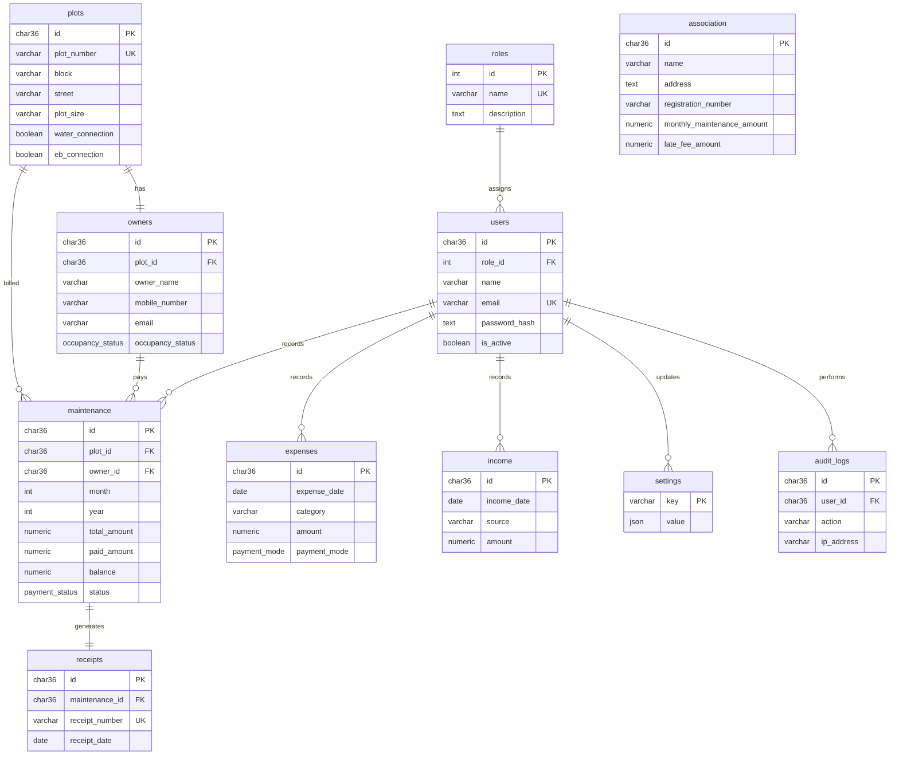

# ER Diagram

```mermaid
erDiagram
  roles ||--o{ users : assigns
  plots ||--|| owners : has
  plots ||--o{ maintenance : billed
  owners ||--o{ maintenance : pays
  maintenance ||--|| receipts : generates
  users ||--o{ maintenance : records
  users ||--o{ expenses : records
  users ||--o{ income : records
  users ||--o{ settings : updates
  users ||--o{ audit_logs : performs

  roles {
    int id PK
    varchar name UK
    text description
  }

  users {
    char36 id PK
    int role_id FK
    varchar name
    varchar email UK
    text password_hash
    boolean is_active
  }

  association {
    char36 id PK
    varchar name
    text address
    varchar registration_number
    numeric monthly_maintenance_amount
    numeric late_fee_amount
  }

  plots {
    char36 id PK
    varchar plot_number UK
    varchar block
    varchar street
    varchar plot_size
    boolean water_connection
    boolean eb_connection
  }

  owners {
    char36 id PK
    char36 plot_id FK
    varchar owner_name
    varchar mobile_number
    varchar email
    occupancy_status occupancy_status
  }

  maintenance {
    char36 id PK
    char36 plot_id FK
    char36 owner_id FK
    int month
    int year
    numeric total_amount
    numeric paid_amount
    numeric balance
    payment_status status
  }

  expenses {
    char36 id PK
    date expense_date
    varchar category
    numeric amount
    payment_mode payment_mode
  }

  income {
    char36 id PK
    date income_date
    varchar source
    numeric amount
  }

  receipts {
    char36 id PK
    char36 maintenance_id FK
    varchar receipt_number UK
    date receipt_date
  }

  settings {
    varchar key PK
    json value
  }

  audit_logs {
    char36 id PK
    char36 user_id FK
    varchar action
    varchar ip_address
  }
```
